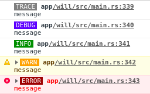

# console_log [](https://crates.io/crates/console_log)

A logger that routes messages to the browser's console.

## Usage

```rust
use log::Level;
fn main() {
    console_log::init_with_level(Level::Debug);

    info!("It works!");

    // ...
}
```

## Details

Rust's log levels map to the browser's console log in the following way.

| Rust       | Web Console       |
|------------|-------------------|
| `trace!()` | `console.debug()` |
| `debug!()` | `console.log()`   |
| `info!()`  | `console.info()`  |
| `warn!()`  | `console.warn()`  |
| `error!()` | `console.error()` |

## Colors

The `"color"` feature adds styling to the log messages.

`Cargo.toml`
```toml
console_log = { version = "0.2", features = ["color"] }
```

The styled log messages will be rendered as follows:



## Code Size

[Twiggy](https://github.com/rustwasm/twiggy) reports this library adding about
180Kb to the size of a minimal wasm binary in a debug build. If you want to
avoid this, mark the library as optional and conditionally initialize it in
your code for non-release builds.

`Cargo.toml`
```toml
[dependencies]
cfg-if = "0.1"
log = "0.4"
console_log = { version = "0.2", optional = true }

[features]
default = ["console_log"]
```

`lib.rs`
```rust
use wasm_bindgen::prelude::*;
use cfg_if::cfg_if;

cfg_if! {
    if #[cfg(feature = "console_log")] {
        fn init_log() {
            use log::Level;
            console_log::init_with_level(Level::Trace).expect("error initializing log");
        }
    } else {
        fn init_log() {}
    }
}

#[wasm_bindgen]
pub fn main() {
    init_log();
    // ...
}
```

## Limitations

The file and line number information associated with the log messages reports
locations from the shims generated by `wasm-bindgen`, not the location of the
logger call.

## License

This project is licensed under either of

 * Apache License, Version 2.0, ([LICENSE-APACHE](LICENSE-APACHE) or
   http://www.apache.org/licenses/LICENSE-2.0)
 * MIT license ([LICENSE-MIT](LICENSE-MIT) or
   http://opensource.org/licenses/MIT)

at your option.

## Contributing

Unless you explicitly state otherwise, any contribution intentionally submitted
for inclusion in this project by you, as defined in the Apache-2.0 license,
shall be dual licensed as above, without any additional terms or conditions.

## See Also

- [`wasm-logger`](https://gitlab.com/limira-rs/wasm-logger)
- [`wasm-bindgen-console-logger`](https://github.com/blm768/wasm-bindgen-console-logger)
- [`fern`](https://github.com/daboross/fern) (use with `console_log::log`)
